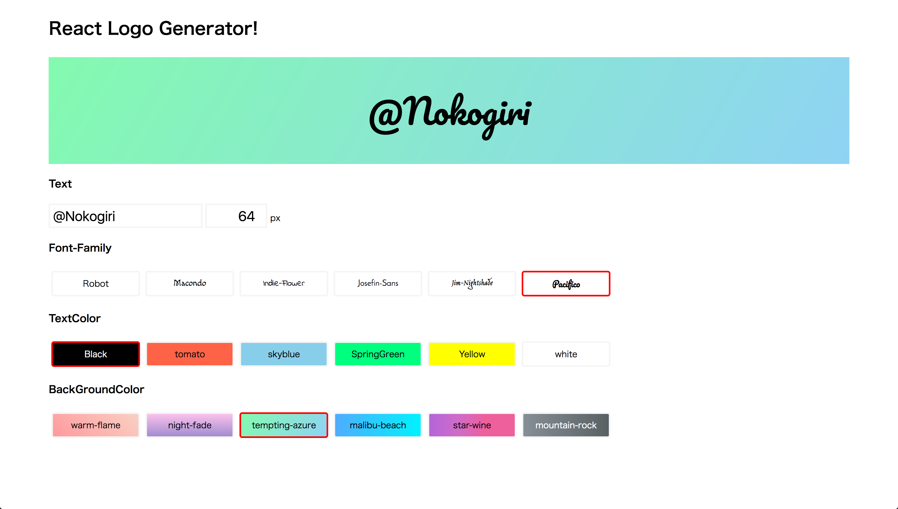

# React Logo Generator

Reactを使ったロゴジェネレーター

## Page
[Logo Generator](https://nokogiring.github.io/ReactLogoGenerator/)

## Description

2017/04/19 React ハンズオンイベントのためのレポジトリ

## Requirement

- Node.js

## Installation

    $ git clone https://github.com/nokogiring/ReactLogoGenerator.git

## Author

[@nokogiring](https://twitter.com/nokogiring)

## License

[MIT](http://b4b4r07.mit-license.org)

## Slide

https://speakerdeck.com/undefined_name/bu-kunaireact
